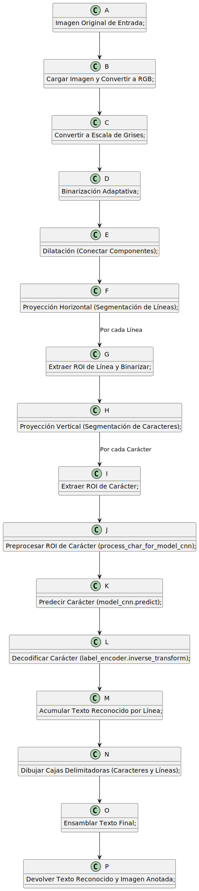

# Examen Final: OCR Inteligencia Artificial

En este documento vamos a hablar sobre mi proyecto relacionado con el Reconocimiento Óptico de Caracteres (*Optical Character Recognition*, OCR) y cómo fui evolucionando mi código hasta llegar a la solución final. 

Primero, abordaré qué es el OCR, su historia y evolución, las problemáticas comunes asociadas y los enfoques existentes para resolverlas. Finalmente, presentaré los objetivos concretos de este proyecto.

---

## Introducción

### Definición y Propósito del Reconocimiento Óptico de Caracteres (OCR)

El Reconocimiento Óptico de Caracteres (OCR) es una tecnología que convierte documentos físicos, como imágenes o archivos escaneados, en texto editable y buscable. En esencia, el OCR traduce imágenes de texto manuscrito o mecanografiado a texto codificado por máquina. Sus objetivos clave incluyen:

- **Automatizar la entrada de datos**: Reducir el tiempo y los errores asociados con el manejo manual de datos.
- **Facilitar la búsqueda de información**: Hacer que documentos físicos sean accesibles en formato digital.
- **Habilitar la interacción digital**: Permitir que aplicaciones digitales trabajen con datos provenientes de documentos físicos.

En el mundo actual, el OCR tiene una amplia gama de aplicaciones prácticas:

- En el sector financiero, para procesar cheques, facturas y formularios.
- En el ámbito legal y documental, al digitalizar expedientes antiguos.
- En bibliotecas y archivos históricos, para preservar libros y manuscritos.
- En el uso cotidiano, en aplicaciones como traductores en tiempo real y sistemas de detección de matrículas.

Su habilidad para transformar imágenes en datos estructurados lo convierte en una tecnología fundamental para la era de la digitalización.

---

### Breve Historia y Evolución del OCR

1. **Primeros avances**:
   - En 1914, Emanuel Goldberg patentó un sistema para convertir caracteres impresos en código telegráfico.
   - En los años 50, David H. Shepard creó el sistema *Graphic Inputting Equipment* (GIE), capaz de leer fuentes limitadas.

2. **Desarrollos en los años 60 y 70**:
   - Nacen los primeros escáneres ópticos comerciales como el "Farrington Optical Scanner".
   - A pesar de ser costosos, permitieron automatizar tareas simples en entornos controlados.

3. **Avances entre los 80 y 90**:
   - Introducción de microprocesadores y desarrollo de algoritmos más avanzados.
   - Surgen las redes neuronales y el aprendizaje automático, mejorando significativamente la capacidad de reconocer caracteres en diferentes contextos.

4. **Revolución del siglo XXI**:
   - Avances en aprendizaje profundo (*Deep Learning*), específicamente con arquitecturas de redes neuronales como *CNNs* y *RNNs*.
   - El OCR actual permite trabajar con texto desordenado, imágenes complejas y fotografías de baja calidad.

---

## El Problema del OCR: Desafíos entre Texto Manuscrito e Impreso

### Desafíos del Reconocimiento de Texto Impreso

1. **Variedad de Fuentes**: 
   - Existen miles de fuentes tipográficas (Arial, Times New Roman, etc.), y cada una tiene variaciones como cursiva, negrita, diferentes tamaños y ornamentaciones.
   
2. **Ruido y Degradación**:
   - Documentos escaneados pueden presentar manchas, baja resolución, degradación por el tiempo y otros defectos.

3. **Distorsiones Geométricas**:
   - Factores como inclinación, curvatura o perspectiva pueden distorsionar el texto, haciendo más difícil su reconocimiento.

4. **Iluminación y Contraste**:
   - Una mala iluminación puede causar dificultades al separar el texto del fondo en la imagen.

---

### Desafíos del Reconocimiento de Texto Manuscrito

1. **Variación Extrema en la Escritura**:
   - Los estilos personales hacen que el mismo carácter pueda variar enormemente dependiendo del individuo o su estado de ánimo.

2. **Uniones y Separaciones Irregulares**:
   - La escritura cursiva introduce un reto adicional ya que las letras suelen unirse, complicando la segmentación de los caracteres.

3. **Inclinación y Tamaño Inconsistentes**:
   - Caracteres de diferentes tamaños o inclinaciones dificultan la estandarización durante el reconocimiento.

4. **Confusión Visual y Ambigüedad Contextual**:
   - Caracteres como `o` y `a`, o `l` y `1`, pueden confundirse dependiendo del contexto.

---

## Enfoques para el Reconocimiento de Caracteres

### Métodos Tradicionales
1. **Template Matching**:
   - Comparación de caracteres contra plantillas predefinidas. Aunque eficaz en fuentes muy controladas, resulta ineficiente para casos de variabilidad.
   
2. **Extracción de Características**:
   - Usar propiedades geométricas y topológicas (bucles, intersecciones) para describir caracteres. Esto sentó bases importantes para modelos clásicos de aprendizaje automático.

3. **Métodos Sintácticos y Estructurales**:
   - Modelar caracteres a través de reglas estructurales y primitivas geométricas. Aunque efectivos en contextos específicos, tienen limitaciones para manejar gran variabilidad.

### Métodos Modernos
1. **Aprendizaje Automático Clásico**:
   - Uso de clasificadores como *k-NN* y *SVMs*.
2. **Aprendizaje Profundo (Deep Learning)**:
   - Utilización de redes convolucionales (*CNNs*) para el reconocimiento de texto, y arquitecturas recurrentes (*RNNs*) como *LSTMs* para manejar texto continuo.

---

## Alcance y Objetivos del Proyecto

### Objetivo General
El objetivo principal es desarrollar un sistema OCR que maneje tanto texto impreso como manuscrito, logrando:

- Reconocimiento preciso de caracteres alfanuméricos.
- Implementación de técnicas basadas en redes neuronales convolucionales (CNN) para superar las dificultades del OCR tradicional.

### Objetivos Específicos
1. Preprocesar un conjunto diverso de datos incluyendo imágenes con variaciones de estilo.
2. Diseñar un modelo basado en *Deep Learning* para el reconocimiento de caracteres individualizados.
3. Crear un pipeline OCR completo, desde la entrada de imagen hasta la generación de texto como salida.
4. Evaluar y documentar el rendimiento del sistema, identificando fortalezas y áreas de mejora.

---

## Solución Propuesta

### Preparación y Preprocesamiento de Datos

1. **Carga del Dataset**:
   - Se extrajo un conjunto de datos diverso desde un archivo comprimido (*zip*) almacenado en Google Drive.

2. **DataFrame para Organización**:
   - Uso de Pandas para organizar imágenes según etiquetas, subcarpetas y metadatos.

3. **Funciones de Preprocesamiento**:
   - *Escala de grises*: Reducir dimensionalidad, enfocándose en la información estructural.
   - *Redimensionamiento*: Unificar dimensiones (64x64 píxeles) para estandarizar entradas a la CNN.
   - *Normalización*: Valores de píxeles entre [0, 1].

---

### Arquitectura del Modelo CNN

El modelo fue diseñado para manejar la variabilidad del OCR:

- **Capas Convolucionales** con funciones de activación ReLU.
- **MaxPooling** para reducción de dimensionalidad.
- **Dropout (60%)** para evitar el sobreajuste.
- **Capa de Salida (Softmax)** para clasificación multiclase.

- **Optimización**: Se utilizó *Adam* junto con la función de pérdida `categorical_crossentropy`.
- **Métrica de Entrenamiento**: Precisión.

---

## Resultados

### Evaluación General
- **Precision inicial**: 0.1%
- **Precisión Mejorada**: 61.03%.
- **Precisión en Datos de Evaluación Manual**: 68.75%.

### Caracteres Reconocidos Correctamente
- Letras como `A`, `b`, `Ñ`, y números (`2`, `7`, `8`).
- Se consideraron fortalezas en la capacidad para manejar tanto texto impreso como manuscrito.

### Problemas Detectados
- **Confusión entre caracteres similares**: Ej. `1` y `l`.
- **Errores de segmentación**: Algunos caracteres fueron mal segmentados o vinculados con sus vecinos.

---

## Conclusión y Posibles Mejoras

### Logros
- Desarrollo de un pipeline OCR funcional con integración de redes profundas (*CNN*).
- Segmentación a nivel de líneas y caracteres.

### Limitaciones Actuales
1. Sensibilidad a caracteres visualmente similares.
2. Problemas de segmentación que afectan el reconocimiento final.
3. Posible sobreajuste del modelo al conjunto de datos.

### Mejoras Futuras
1. Usar técnicas avanzadas de segmentación como *Mask R-CNN* o *YOLO*.
2. Incrementar el dataset con técnicas de *data augmentation*.
3. Explorar arquitecturas modernas, como Transformers o enfoques híbridos *Seq2Seq* para procesar texto continuo.

¡Este proyecto ha sentado las bases para futuras mejoras en sistemas de OCR práctico y escalable!
